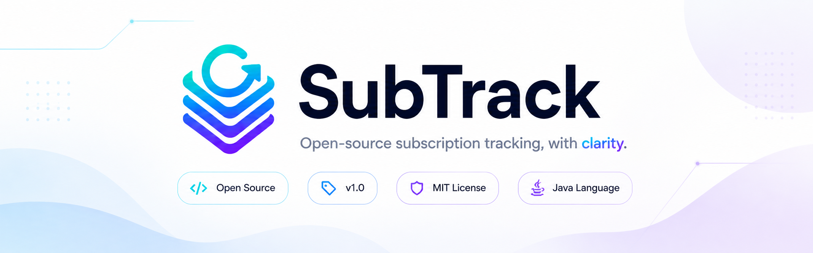

<p align="center">
  
</p>

<h1 align="center">SubTrack</h1>
<p align="center">
  A modern Spring Boot MVC dashboard for tracking digital subscriptions, renewals, and monthly spending.
</p>

<p align="center">
  
  
  
  
  
  
</p>

## Overview
SubTrack is a desktop-oriented web application built with Spring Boot MVC and Thymeleaf.
It helps users manage recurring subscriptions, monitor costs, and stay ahead of renewals with a clean SaaS-style dashboard.

## Key Features
- Subscription dashboard with KPI cards and spending overview
- Subscription management flow (list, create, details, edit, delete)
- Category, provider, payment, and reminder service layers
- In-memory application-wide storage (no external database)
- Modular Thymeleaf templates with reusable fragments
- Responsive UI with modern card/table/layout styling

## Tech Stack
- **Backend:** Spring Boot, Spring MVC
- **View Layer:** Thymeleaf
- **Aspect Support:** Spring AOP
- **Validation:** Spring Validation
- **Build Tool:** Maven Wrapper
- **Data Storage:** Application-scope in-memory storage

## Project Structure
```text
src/main/java/rs/ac/metropolitan/subtrack
  config/
  controller/
  model/
  service/
  storage/

src/main/resources
  templates/
    fragments/
  static/
    css/
    img/
```

## Getting Started
### 1. Run tests
```bash
./mvnw clean test
```

### 2. Start the application
```bash
./mvnw spring-boot:run
```

### 3. Open in browser
- [http://localhost:8080](http://localhost:8080)
- [http://localhost:8080/dashboard](http://localhost:8080/dashboard)

## Main Routes
- `/dashboard`
- `/subscriptions`
- `/calendar`
- `/analytics`
- `/reminders`
- `/budgets`
- `/settings`

## Development Workflow
1. Start the app with `./mvnw spring-boot:run`
2. Update templates/styles and refresh the browser
3. Update Java code (DevTools handles restart)
4. Run `./mvnw clean test` before each commit

## Current Progress
Completed:
- Initial Spring Boot MVC setup
- Core domain models and enums
- Application-scope storage
- Demo data initialization
- Subscription, category, provider, payment, and reminder services
- Dashboard and subscription pages with modern UI

In progress / next:
- Full CRUD pages for categories and providers
- Payment and reminder management pages
- Audit and performance aspects (AOP)
- Final documentation and screenshot pack

## Useful Commands
```bash
# run tests
./mvnw clean test

# start app
./mvnw spring-boot:run

# check local changes
git status
```

---

<p align="center">
  
</p>
<p align="center">
  <strong>SubTrack</strong><br/>
  <em>Organize. Track. Save.</em>
</p>
